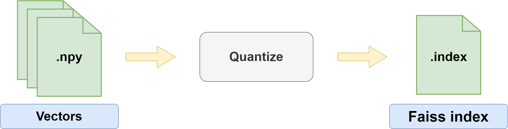

autofaiss reference documentation
=================================

Creating and tuning quantized KNN indices for efficient similarity search with low memory usage.

.. toctree::
   :maxdepth: 2
   :caption: Introduction and installation

   introduction/introduction
   
.. toctree::
   :maxdepth: 2
   :caption: Getting started with the CLI

   getting_started/quantization

.. toctree::
   :glob:
   :maxdepth: 2
   :caption: Getting started with notebooks

   _notebook_folders/

Indices and tables
==================

* :ref:`genindex`
* :ref:`modindex`
* :ref:`search`
